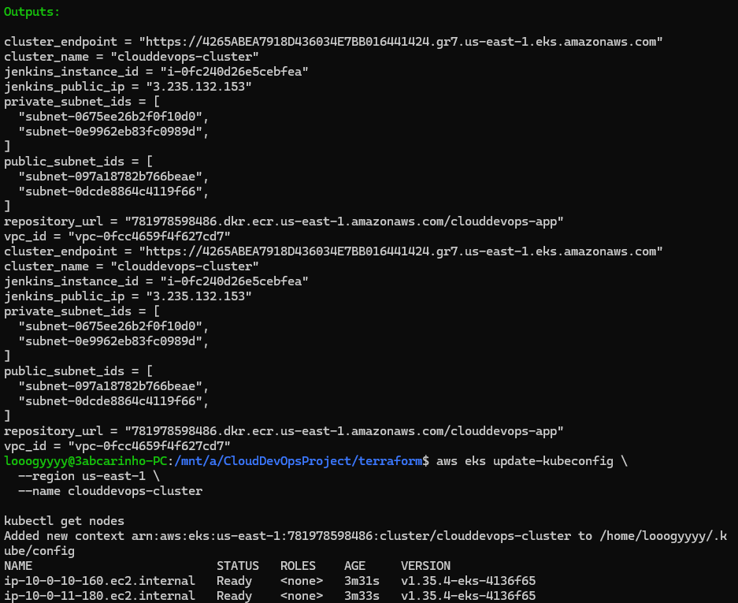
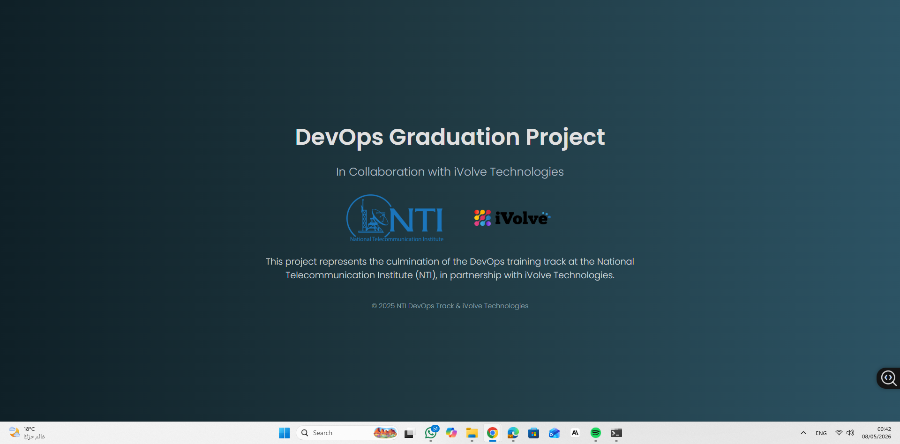
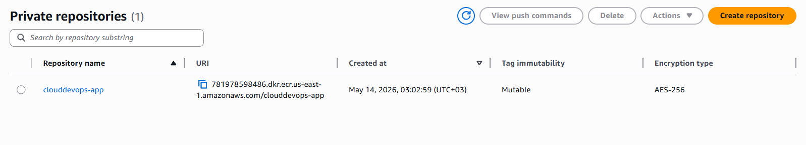
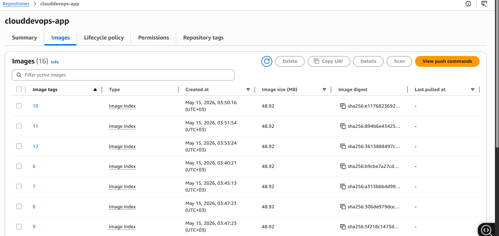
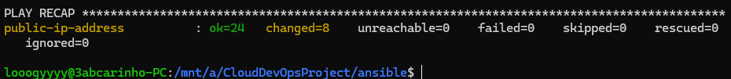
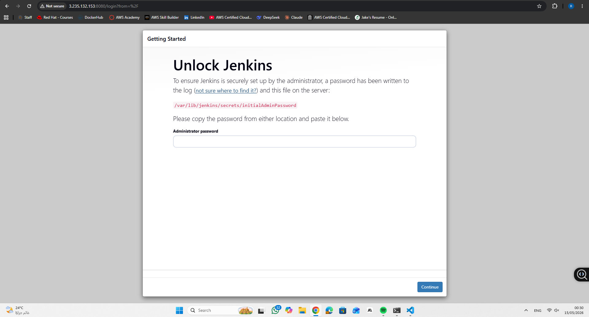
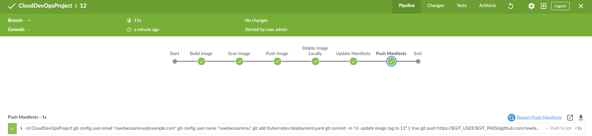
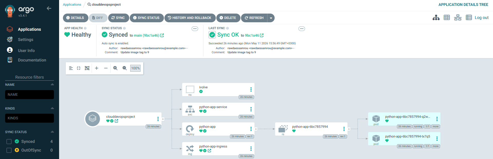

# End-to-End DevOps Pipeline on AWS

A full end-to-end DevOps project implementing a complete CI/CD pipeline on AWS, built as the graduation project for the NTI DevOps Training Track in collaboration with iVolve Technologies.

The project covers the full DevOps lifecycle: containerizing a Python Flask application, provisioning cloud infrastructure with Terraform, configuring servers with Ansible, orchestrating workloads on Kubernetes, automating builds with Jenkins, and achieving continuous deployment through ArgoCD GitOps.

---

## Architecture Overview

The project is structured around two layers: a CI layer driven by Jenkins running on an EC2 instance, and a CD layer driven by ArgoCD running on an EKS cluster. Every code change triggers a Jenkins pipeline that builds, scans, and pushes a Docker image to ECR, then updates the Kubernetes manifests in the repository. ArgoCD detects the manifest change and automatically syncs the new image to the EKS cluster.

```
Developer → GitHub → Jenkins (EC2)
                        ↓
                   Docker Build
                        ↓
                   Trivy Scan
                        ↓
                   Push to ECR
                        ↓
               Update K8s Manifests → GitHub
                                          ↓
                                       ArgoCD
                                          ↓
                                    EKS Cluster
                                          ↓
                                   ivolve namespace
```

### AWS Infrastructure

The infrastructure is fully provisioned with Terraform across four modules:

- **Network** — a dedicated VPC (`10.0.0.0/16`) with two public subnets and two private subnets across `us-east-1a` and `us-east-1b`, an Internet Gateway, a NAT Gateway for private subnet egress, and a Network ACL.
- **Server** — a `t3.micro` EC2 instance running Ubuntu 22.04 in the public subnet, serving as the Jenkins build server. Security group allows ports 22 and 8080.
- **EKS** — a managed Kubernetes cluster (`clouddevops-cluster`) with a node group of two `t3.micro` worker nodes distributed across the two private subnets in different availability zones.
- **ECR** — a private container registry (`clouddevops-app`) for storing versioned application images with a lifecycle policy retaining the last five images.

Terraform remote state is stored in an S3 bucket with versioning enabled.



---

## Repository Structure

```
CloudDevOpsProject/
├── Dockerfile
├── Jenkinsfile
├── SourceCode/
│   ├── app.py
│   └── requirements.txt
├── Kubernates/
│   ├── namespace.yaml
│   ├── deployment.yaml
│   ├── service.yaml
│   └── ingress.yaml
├── argocd/
│   └── application.yaml
├── terraform/
│   ├── main.tf
│   ├── variables.tf
│   ├── outputs.tf
│   ├── backend.tf
│   └── modules/
│       ├── network/
│       ├── server/
│       ├── eks/
│       └── ecr/
├── ansible/
│   ├── playbook.yml
│   ├── ansible.cfg
│   ├── inventory/
│   │   └── aws_ec2.yml
│   └── roles/
│       ├── java/
│       ├── jenkins/
│       └── packages/
└── vars/
    ├── dockerUtils.groovy
    ├── manifestUtils.groovy
    └── gitUtils.groovy
```

---

## Components

### Dockerfile

The application is containerized from a Python 3.9 slim base image. Dependencies are installed from `SourceCode/requirements.txt` and the Flask application is served on port 5000.



---

### Terraform Modules

**Network module** provisions the full networking layer including VPC, subnets, IGW, NAT Gateway, route tables, and Network ACL.

**Server module** provisions the Jenkins EC2 instance with an Ubuntu 22.04 AMI, attaches a security group allowing SSH and Jenkins UI access, and tags the instance with `Role=jenkins` for Ansible dynamic inventory discovery.

**EKS module** provisions the cluster control plane and a managed node group with the required IAM roles and policy attachments for `AmazonEKSClusterPolicy`, `AmazonEKSWorkerNodePolicy`, `AmazonEC2ContainerRegistryReadOnly`, and `AmazonEKS_CNI_Policy`.

**ECR module** provisions a private repository with image scanning on push and a lifecycle policy.





---

### Ansible Roles

Configuration management is handled by three Ansible roles applied to the Jenkins EC2 instance discovered via the AWS EC2 dynamic inventory plugin, which filters instances by the `Role=jenkins` tag.

- **java** — enables the Ubuntu universe repository and installs OpenJDK 17.
- **jenkins** — imports the Jenkins GPG key from the Ubuntu keyserver, adds the official Jenkins apt repository, installs Jenkins, and starts the service.
- **packages** — installs Docker CE, adds the jenkins user to the docker group, and installs Trivy for image vulnerability scanning.



---

### Kubernetes Manifests

All workloads are deployed into the `ivolve` namespace. The Deployment runs one replica of the application with the image reference updated automatically by the Jenkins pipeline on every build. A ClusterIP Service and an Ingress resource expose the application internally.

---

### Jenkins Pipeline

The pipeline is defined in a `Jenkinsfile` and uses a shared library (`my-shared-library`) sourced from the `vars/` directory of this repository. The pipeline consists of six stages:

1. **Build Image** — builds the Docker image tagged with the Jenkins build number and the ECR repository URL.
2. **Scan Image** — runs Trivy against the built image to check for vulnerabilities.
3. **Push Image** — authenticates to ECR using AWS credentials and pushes the image.
4. **Delete Image Locally** — removes the local image to free disk space on the Jenkins EC2.
5. **Update Manifests** — clones the repository and updates the image tag in `Kubernates/deployment.yaml` using `sed`.
6. **Push Manifests** — commits and pushes the updated manifest back to the main branch using GitHub credentials.





---

### ArgoCD

ArgoCD is deployed in the `argocd` namespace on the EKS cluster. The `Application` resource points to the `Kubernates/` directory of this repository on the `main` branch. Automated sync is enabled with `prune: true` and `selfHeal: true`, meaning ArgoCD will automatically deploy any manifest changes pushed by the Jenkins pipeline and correct any manual drift.



---

## Key Details

| Resource | Value |
|---|---|
| AWS Region | us-east-1 |
| EKS Cluster | clouddevops-cluster |
| ECR Repository | clouddevops-app |
| Jenkins EC2 | t3.micro, Ubuntu 22.04 |
| EKS Node Type | t3.micro × 2 |
| App Namespace | ivolve |
| Terraform Backend | S3 (us-east-1) |
| Jenkins Shared Library | vars/ (this repo) |

---

## Author

Rawda Essam

NTI DevOps Track × iVolve Technologies — 2026
